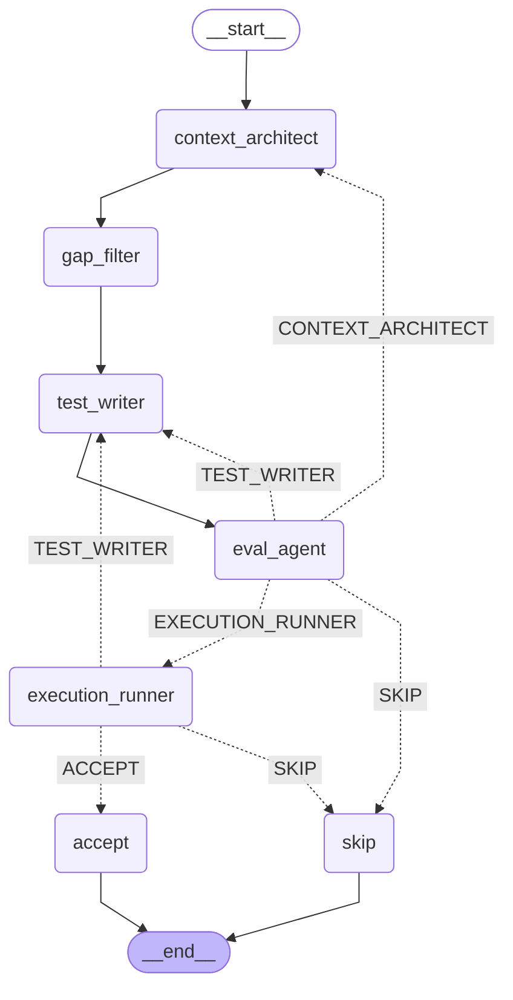

# CoverageAgent

A multi-agent pipeline that finds uncovered Python branches, writes targeted pytest tests for each gap, and verifies every test before keeping it.

 

## What it does

CoverageAgent ingests a coverage report (or runs one for you), finds uncovered branch arcs (`from_line → to_line`), and for each gap runs a LangGraph pipeline that: builds static context with Jedi, generates a pytest test with a ReAct loop, evaluates it, and runs it under `coverage run --branch`. A test is only kept when the target arc is verifiably executed — pytest green alone is not enough.

## Pipeline



| Node | What it does |
|---|---|
| **context_architect** | Jedi traversal: assembles target function source + callee signatures into a `ContextPayload` (≤15k tokens) |
| **gap_filter** | Marks gap difficulty (`easy`/`hard`) based on IO-heavy symbols and context token count |
| **test_writer** | ReAct loop: litellm function-calling with `read_source`, `find_symbol`, `find_usages`, `run_candidate` tools |
| **eval_agent** | Deterministic gate: `ast.parse` syntax check + import plausibility; routes to EXECUTE, REWRITE, or RECONTEXTUALIZE |
| **execution_runner** | Runs `coverage run --branch --append -m pytest`; checks target arc in `.coverage` arcs; repeats `flaky_runs` times |
| **accept / skip** | Terminal nodes; `accept` fires when `execution_success AND target_branch_hit` |

## Quick start

```bash
git clone https://github.com/bhavikupadhyay/coverage-agent.git
cd coverage-agent
uv sync

# Set a model key (Gemini free tier works)
export GEMINI_API_KEY=<your-key>

# Run on the current repo (auto-runs coverage if no .coverage file found)
coverage-agent run --scope full --max-gaps 5

# Run on an external repo
coverage-agent run --repo https://github.com/un33k/python-slugify --max-gaps 5

# Run on a local checkout
coverage-agent run --repo /path/to/repo --max-gaps 5

# Write a RunReport JSON
coverage-agent run --scope full --max-gaps 5 --output report.json

# Pretty-print a saved report
coverage-agent report report.json

# List available models
coverage-agent models
```

## Configuration

Drop a `.coverage-agent.yml` in your repo root. All fields are optional — defaults work out of the box.

```yaml
version: 1
model: gemini/gemini-2.5-flash   # any litellm model string
scope: full                       # full | diff
max_gaps: 10
test_command: pytest -q
tests_dir: tests/generated
flaky_runs: 3
test_timeout: 60
budget_usd: 1.00
exclude:
  - "**/migrations/**"
  - "**/conftest.py"
  - "tests/**"
  - "test_*.py"
```

## Supported models

Any model in `coverage_agent/models.json`. Pass `--model <id>` to override. The ReAct tool-calling loop activates only for models with `tool_calling: true`; others fall back to single-shot generation.

```bash
coverage-agent models   # prints the full registry table
```

## Benchmarks

Raw JSON in [`benchmarks/results/`](benchmarks/results/).

| Repository | Gaps Targeted | Tests Committed | Skipped | Branch Hit Rate | Coverage Delta | Avg Loops | LLM Cost |
|---|---|---|---|---|---|---|---|
| `psf/requests`     | — | — | — | — | — | — | — |
| `pydantic/pydantic`| — | — | — | — | — | — | — |
| `pallets/click`    | — | — | — | — | — | — | — |
| **Total**          | — | — | — | — | — | — | — |

## Tests

```bash
uv run pytest -q
# 115 tests, ~6 seconds, no network calls
```

Optional Braintrust eval logging — set `BRAINTRUST_API_KEY` before a run and every gap result is logged to the `coverage-agent` project automatically.

## License

Apache 2.0 — see [`LICENSE`](LICENSE).
