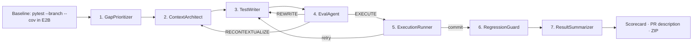

# CoverageAgent

A multi-agent pipeline that finds uncovered Python branches in any GitHub repo, writes targeted pytest tests for each one, and verifies every test in an isolated sandbox before handing it back to you.

    

## What it does

CoverageAgent takes a public GitHub Python repo URL, runs `pytest --branch --cov` in an E2B Firecracker sandbox, and finds uncovered branches — each gap is a specific `from_line → to_line` pair in the control flow, not just a missing line. It then runs seven agents that produce, evaluate, and sandbox-verify a pytest test for each gap, and hands you a ZIP of committed tests alongside a PR-ready narrative.

The pipeline is auditable end-to-end. Every draft, eval critique, sandbox run, and coverage delta is surfaced in the web UI as an editorial report so you can see exactly what each agent decided and why. The commit bar is strict: a test is only kept when the sandbox confirms that the specific target branch was executed — pytest green alone is not enough.

## The pipeline

One run is a **baseline step** plus **seven agents** in two phases:

- **Per-gap loop (agents 1–5)** — runs once per uncovered branch, retries up to three times per gap.
- **End-of-run checks (agents 6–7)** — run once per run, after all gaps are processed.



| Step | LLM calls | Runs per | What it does |
|---|---|---|---|
| **Baseline** (sandbox, not an agent) | No | Run | Runs `pytest --branch --cov` in E2B, parses `coverage.json` into a list of uncovered `(from_line, to_line)` branch pairs per file. Captures the baseline pass/fail count for RegressionGuard. |
| **1. GapPrioritizer** | Optional | Run | Scores each gap 0.0–1.0 using a deterministic heuristic on file path, symbol name, and gap size. LLM ranking is opt-in via `Credentials.prioritize_with_llm` (off by default). |
| **2. ContextArchitect** | No | Gap | Picks graph depth (0/1/2) with a heuristic on surrounding-line count, then walks Jedi inside the sandbox to assemble a context payload: target function source, callee signatures, and an AST-extracted `branch_condition_hint`. Capped at 15k tokens. |
| **3. TestWriter** | Yes | Gap (+ retries) | Generates 1–2 pytest functions targeting the specific branch. Receives `branch_condition_hint` from ContextArchitect and a critique string on retries (from Eval or the sandbox `stderr`). |
| **4. EvalAgent** | No | Gap (+ retries) | Deterministic gate: ruff F821 syntax check (falling back to `ast.parse`) then import plausibility against stdlib, pytest, and the target package's dependency map. Routes to `EXECUTE`, `REWRITE`, or `RECONTEXTUALIZE`. No LLM calls. |
| **5. ExecutionRunner** | No | Gap (+ retries) | Writes the draft to the E2B sandbox, runs `coverage run --branch --append`, computes whether the target branch was newly executed and the coverage delta. Re-runs 3× on first success to detect flakiness. If the commit bar isn't met, sends `stderr` back as a critique to TestWriter. |
| **6. RegressionGuard** | No | Run | Persists every committed test file in the sandbox, re-runs the full pytest suite, and compares pass/fail counts against the pre-run baseline. Catches fixture conflicts, global state pollution, and monkey-patching issues that per-gap isolation misses. |
| **7. ResultSummarizer** | Yes (1×) | Run | One LLM call at the very end. Produces a markdown PR description (~120 words) and a full run narrative (~300 words) covering which gaps were committed, which were skipped, and why. Cost is amortized across all gaps. |

### Retry mechanics

The per-gap loop budget is shared across Eval retries and sandbox retries. `loop_count` increments on REWRITE, RECONTEXTUALIZE, and failed sandbox runs. Retries from `ExecutionRunner` forward `stderr_trace` as a critique so TestWriter has concrete feedback on the next attempt.

| Preset | Max loops per gap |
|---|---|
| `strict` | 3 |
| `balanced` (default) | 3 |
| `loose` | 1 |

The commit bar — `execution_success AND target_branch_hit` — is identical across all presets.

## Eval strictness

Every run accepts an `eval_strictness` knob that controls the retry budget. The commit bar does not change.

| Preset | Retries per gap | When to use |
|---|---|---|
| `strict` | 3 | Maximum retry budget; same branch-proof commit bar as the others. |
| `balanced` (default) | 3 | Default for API, UI, and CLI. What the benchmark numbers below use. |
| `loose` | 1 | One attempt per gap; move fast, commit less. Still requires branch proof. |

In the UI: a 3-pill segmented control under "Strictness". In the API: `eval_strictness` on `POST /api/run`. In the CLI: `--strictness {strict,balanced,loose}`.

## Run modes

| Mode | Keys needed | Max gaps | Use case |
|---|---|---|---|
| **Offline** | None | 3 | Local dev, CI, UI screenshots — returns fixture data for every agent and the sandbox |
| **Demo** | None (server-provided) | 3 | Public demo server; operator sets `DEMO_GROQ_API_KEY` + `DEMO_E2B_API_KEY` |
| **BYOK** | Your own Groq + E2B | 15 | Real analysis on any public repo |

Credentials flow explicitly through a frozen `Credentials` dataclass — no `os.environ` mutation during a run, no global state. Two concurrent BYOK runs with different keys are completely isolated. See `coverage_agent/credentials.py` and `tests/test_credentials_isolation.py` for the invariant tests.

## Quickstart

### Get free keys

- **Groq** — [console.groq.com/keys](https://console.groq.com/keys) (free, no card required; `llama-3.3-70b-versatile`: 30 RPM, 14 400 TPM)
- **E2B** — [e2b.dev/dashboard](https://e2b.dev/dashboard) (free tier: 100 sandbox hours/month)
- **Braintrust** — [braintrust.dev](https://braintrust.dev) (optional; for eval tracing)

### Local (uv)

```bash
git clone https://github.com/bhavikupadhyay/coverage-agent.git
cd coverage-agent
uv sync --extra dev
cp .env.example .env   # fill in GROQ_API_KEY + E2B_API_KEY

# Web UI
uvicorn app:app --reload
# → http://localhost:8000

# CLI
uv run python run_benchmark.py \
  --repo https://github.com/psf/requests \
  --max-gaps 5 \
  --strictness balanced
```

### Offline (no keys)

The full pipeline runs against bundled fixtures when `OFFLINE_MODE=true`. The web UI, CLI, and all agents respect this flag:

```bash
OFFLINE_MODE=true uvicorn app:app --reload
# → http://localhost:8000 (fully functional, no keys needed)

OFFLINE_MODE=true uv run python run_benchmark.py --repo /any/path --max-gaps 3
```

### Docker

```bash
# Live mode — needs GROQ_API_KEY + E2B_API_KEY in .env
docker compose up coverage-agent
# → http://localhost:8000

# Offline mode — no keys required
docker compose --profile offline up coverage-agent-offline
# → http://localhost:8001
```

The `.local/` volume mount persists SQLite run history across container restarts.

## CLI reference

`run_benchmark.py` is the CLI entry point. It supports a `compare` mode that runs both the full pipeline and a naive single-shot baseline on the same gap set, printing a side-by-side verdict table.

| Flag | Default | Choices | Description |
|---|---|---|---|
| `--repo` | required | URL or local path | Public GitHub URL (`https://github.com/owner/repo`) or local checkout path |
| `--max-gaps` | 10 | any int | Number of gaps to target |
| `--strictness` | `balanced` | `strict` / `balanced` / `loose` | Retry budget per gap (commit bar unchanged) |
| `--mode` | `pipeline` | `pipeline` / `naive` / `compare` | `compare` runs both and prints a delta table |
| `--offline` | false | flag | Force offline fixtures (same as `OFFLINE_MODE=true`) |
| `--output` | — | file path | Write full JSON benchmark report to this path |

`--mode compare` runs `Orchestrator` and `NaiveSingleShotRunner` on the same gap set (same priority order, same sandbox) and prints columns for tests committed, branch hit rate, coverage delta, LLM cost, and a WINS/TIE/LOSES verdict. If the pipeline doesn't beat the single-shot baseline, the multi-agent overhead is unjustified.

## Web UI and API

### REST endpoints

| Method | Path | Purpose | Response shape |
|---|---|---|---|
| `GET` | `/health` | Server health | `{ status, demo_available, default_model }` |
| `POST` | `/api/preflight` | Pre-run validation | `{ ready, repo: {ok, message}, llm: {ok, message}, e2b: {ok, message} }` |
| `POST` | `/api/run` | Start a run | `{ run_id, status, mode }` |
| `GET` | `/api/run/{id}` | Final scorecard + per-gap results | `{ run_id, status, logs, scorecard, results, recommendations, error, … }` |
| `GET` | `/api/run/{id}/events` | SSE stream during run | Typed `AgentEvent` objects |
| `GET` | `/api/run/{id}/zip` | Download committed tests | ZIP archive |

`POST /api/run` request body:

```json
{
  "mode": "byok",
  "repo_url": "https://github.com/owner/repo",
  "max_gaps": 5,
  "eval_strictness": "balanced",
  "llm_api_key": "gsk_...",
  "e2b_api_key": "e2b_...",
  "model": "groq/llama-3.3-70b-versatile",
  "braintrust_api_key": "sk-..."
}
```

### SSE event types

The `/api/run/{id}/events` stream emits typed events throughout the run. The web UI uses these to drive the live agent visualization.

| Event type | When emitted | Key fields |
|---|---|---|
| `gap_start` | Before each gap begins | `gap_idx`, `total_gaps` |
| `agent_start` | Before each agent runs | `agent` name |
| `agent_end` | After each agent returns | `agent` name |
| `gap_end` | After a gap completes | `committed`, `original_code` |
| `log` | Python log records from agents | `msg` |
| `done` | Pipeline complete | — |
| `error` | Unrecoverable failure | — |

### /api/preflight

The **Generate tests** button calls this before starting a run. It runs three independent checks in parallel — all under ~2 seconds total — so bad credentials or wrong-language repos surface as inline status chips instead of failing 90 seconds into the pipeline:

1. **Repo check** — GitHub API `GET /repos/{owner}/{repo}`: confirms the repo is public and the language is Python.
2. **LLM check** — 1-token completion to validate auth and model availability.
3. **E2B check** — `Sandbox.list()` to confirm the API key is valid.

## Benchmark results

Raw JSON in [`benchmarks/results/`](benchmarks/results/).

| Repo | Gaps targeted | Tests committed | Coverage delta | Avg loops |
|---|---|---|---|---|
| `un33k/python-slugify` | 2 | 1 | +33.33% | 2.0 |

### What these numbers mean

The pipeline identified two uncovered branches in `python-slugify`, generated targeted tests for each, sandbox-verified them in an isolated E2B environment, and committed a test that moved branch coverage by +33.33 percentage points. The commit bar requires that the target branch is actually executed in the sandbox — pytest green alone is not enough. The committed test cleared that bar; the second gap was skipped after hitting the retry budget.

### Known limitations

- **Groq free-tier TPM ceiling**: 14 400 TPM on `llama-3.3-70b-versatile`. CoverageAgent ships three mitigations: EvalAgent is fully deterministic (0 LLM calls, frees the bucket entirely), ContextArchitect uses a heuristic for depth (saves 1 call per gap), and the TPM throttle (`tpm_throttle.py`) inserts back-pressure between gaps before hitting rate limits. Per-day RPD limits remain a hard ceiling on free tiers.
- **Cost reporting**: LiteLLM doesn't price Groq's free tier in its catalog, so `llm_cost` reports `$0.0000` even on real calls. Real cost emerges automatically on paid providers (OpenAI, Anthropic, etc.).

The benchmark numbers above are a floor, not a ceiling.

## Architecture at a glance

For the full architectural deep-dive — agent specs, data contracts, LangGraph state machine, credential threading, sandbox lifecycle, design decision log — see [`docs/ARCHITECTURE.md`](docs/ARCHITECTURE.md).

### Repository layout

```
coverage-agent/
├── app.py                              # FastAPI app: REST API + SSE + static SPA serving
├── run_benchmark.py                    # CLI entry point (pipeline / naive / compare modes)
├── pyproject.toml                      # uv + hatchling project config
├── Dockerfile                          # Multi-stage build (builder + runtime)
├── docker-compose.yml                  # Two services: live (8000) + offline (8001)
│
├── coverage_agent/
│   ├── orchestrator.py                 # Outer loop: gap iteration, sandbox lifecycle, aggregation
│   ├── pipeline.py                     # LangGraph StateGraph: nodes, routing, retry edges
│   ├── run_engine.py                   # EventBus, RunRecord, execute_run (shared web+CLI layer)
│   ├── credentials.py                  # Credentials dataclass + 4 factory methods; no env mutation
│   ├── preflight.py                    # Pre-run: GitHub repo check, LLM auth, E2B auth
│   ├── cost_tracker.py                 # Per-run LLM cost via litellm.success_callback
│   ├── tpm_throttle.py                 # Rolling 60s TPM window throttle for Groq free tier
│   ├── error_mapper.py                 # Maps exceptions → user-friendly messages
│   ├── db.py                           # SQLite run history (.local/coverage_agent_runs.db)
│   ├── recommendations.py              # Post-run guidance when branch was missed
│   ├── rate_limiter.py                 # Demo vs. BYOK concurrency semaphores
│   ├── config.py                       # DEFAULT_MODEL, is_offline_mode()
│   │
│   ├── agents/
│   │   ├── gap_prioritizer.py          # Agent 1: deterministic heuristic; LLM opt-in
│   │   ├── context_architect.py        # Agent 2: Jedi traversal, depth heuristic
│   │   ├── test_writer.py              # Agent 3: LLM test generation
│   │   ├── eval_agent.py               # Agent 4: ruff + import gate (deterministic)
│   │   ├── execution_runner.py         # Agent 5: E2B sandbox + 3-run flakiness check
│   │   ├── regression_guard.py         # Agent 6: post-commit full suite re-run
│   │   └── result_summarizer.py        # Agent 7: PR description + run narrative (1 LLM call)
│   │
│   ├── contracts/schemas.py            # 9 Pydantic v2 schemas — single source of truth
│   │
│   ├── context/
│   │   ├── jedi_graph.py               # Jedi traversal, callee extraction, token budgeting
│   │   ├── coverage_parser.py          # coverage.json → CoverageGap list
│   │   └── branch_conditions.py        # AST condition extraction → branch_condition_hint
│   │
│   ├── sandbox/e2b_runner.py           # E2B lifecycle: setup, baseline, test execution, pause/resume
│   ├── evals/braintrust_logger.py      # Optional Braintrust dataset logging
│   ├── baselines/naive_single_shot.py  # Single-shot LLM baseline for --mode compare
│   └── fixtures/                       # Offline mode fixture data
│
├── public/
│   ├── index.html                      # Single-page app (3 sections: launch / running / report)
│   ├── app.js                          # SSE client, state management, results rendering
│   └── custom.css                      # Editorial design system (Playfair + Instrument Sans)
│
├── tests/                              # 13+ test files; all pass under OFFLINE_MODE=true
│   ├── agents/                         # Per-agent unit tests
│   └── conftest.py                     # Shared fixtures (offline_creds, sample gaps, etc.)
│
└── benchmarks/results/                 # Committed benchmark JSON (requests v1–v5)
```

### Three design decisions that shape everything

1. **Jedi, not RAG.** Context is assembled via static analysis — `goto()` traversal, cross-file import resolution, explicit token budgeting. Deterministic and dependency-graph-aware. RAG retrieves semantically similar code; Jedi retrieves *functionally related* code.

2. **EvalAgent is deterministic.** The original design had LLM mock-completeness and assertion-quality scoring. That was removed after v3 benchmarks showed the LLM gave 5/5 scores to tests that crashed at runtime. The sandbox is the judge for semantics.

3. **Credentials are threaded explicitly.** Every agent receives a `Credentials` dataclass constructed once per run. Nothing reads `os.environ` mid-run. Two concurrent BYOK runs with different Groq keys cannot bleed into each other.

## Tests

```bash
OFFLINE_MODE=true uv run pytest tests/ -q
# Full suite in under 30 seconds, zero network calls
```

Live smoke test (requires a real Groq key, skipped by default):

```bash
GROQ_API_KEY=... uv run pytest tests/smoke_groq.py -v
```

## Contributing

See [`CONTRIBUTING.md`](CONTRIBUTING.md). The non-negotiables: agents never read `os.environ` for credentials, no global state between runs, offline mode must work for every agent, and `contracts/schemas.py` schemas are stable.

## License

Apache 2.0 — see [`LICENSE`](LICENSE).
